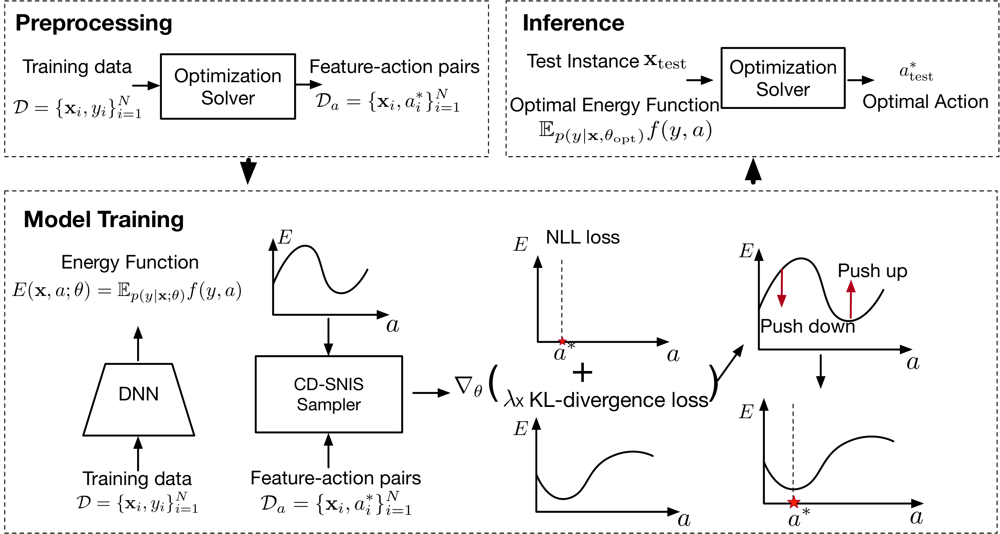

# SO-EBM
This repo contains our code for paper: 

End-to-End Stochastic Optimization with Energy-Based Model, Lingkai Kong, Jiaming Cui, Yuchen Zhuang, Rui Feng, B. Aditya Prakash, Chao Zhang

[[paper](https://arxiv.org/abs/2211.13837)] 




## Training and Evaluation

Training with the two-stage model:
```
python two-stage.py --lr 0.001
```

Training with DFL:
```
python DFL.py --lr 0.0001
```
Evaluation for the baselines:
```
python test_baseline.py 
```
Training with SO-EBM
```
python SO-EBM.py
```

## Citation
Please cite the following paper if you find this repo helpful. Thanks!
```
@inproceedings{kongend,
  title={End-to-end Stochastic Optimization with Energy-based Model},
  author={Kong, Lingkai and Cui, Jiaming and Zhuang, Yuchen and Feng, Rui and Prakash, B Aditya and Zhang, Chao},
  booktitle={Advances in Neural Information Processing Systems}
  year={2020}
}
```
